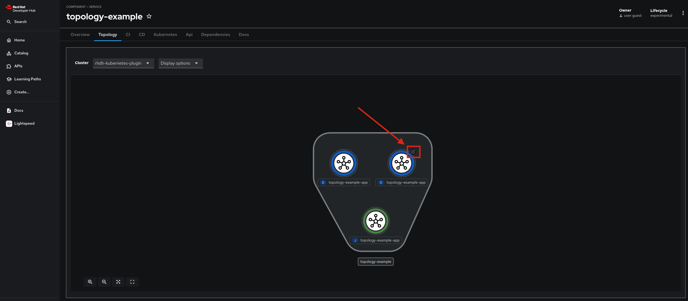

# AI Software Template

# Background

You deployed this application named **codegen-j1744951033089** from an AI Software Template! This template created a new source code repository as well as a new GitOps deployment repository for you. You are able to find more information related to these repository locations in [Repository Information](#repository-information).

# Usage

The template you used contains the deployment of a sample application. To access this sample application, complete the following instructions.

You can view the Topology of deployed resources by navigating to the **Topology** tab in your RHDH ribbon:

From that view, to navigate straight to your sample application, you can click the arrow on the resource of the application.

# Model & Model Server Information
The following model was deployed by the template for your use: **[Nondzu/Mistral-7B-code-16k-qlora](https://huggingface.co/Nondzu/Mistral-7B-code-16k-qlora)**.

This model is accessible through a model service. You chose **[llama.cpp]( https://github.com/containers/ai-lab-recipes/tree/main/model_servers/llamacpp_python)** as your service.

# Repository Information

The source code for your chosen application can be found in [https://github.com/rhdh-pai-qe/codegen-j1744951033089](https://github.com/rhdh-pai-qe/codegen-j1744951033089).

The GitOps repository, which contains the Kubernetes manifests for the application can be found in 
[https://github.com/rhdh-pai-qe/codegen-j1744951033089-gitops](https://github.com/rhdh-pai-qe/codegen-j1744951033089-gitops). 

# Deployment Information

You can find deployed resources from this template in the **rhdh-app** namespace.
